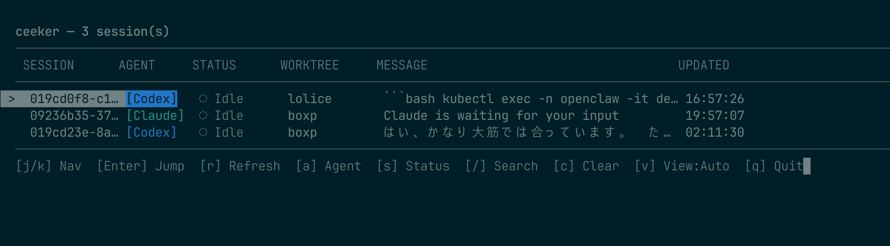

# ceeker

> [English](./README.md)

tmuxペインを横断してAIコーディングエージェントのセッション・進捗をモニタリングするTUI。

複数のAIコーディングエージェント（Claude Code / Codex）が並行動作する環境で、各セッションの状態を一覧表示し、tmuxペインへのジャンプを可能にする。



## なぜ ceeker？

- **Windows（WSL）、Linux、macOS で動作**
- **Claude Code と Codex の両方に対応**
- **`Enter` キーひとつで対象の Claude Code / Codex ペインにジャンプ**
- **複数エージェントセッションをまとめて監視**

## 前提条件

- tmux

## インストール

### ワンライナーインストール

```bash
curl -fsSL https://raw.githubusercontent.com/boxp/ceeker/main/install.sh | sh
```

対応プラットフォーム: `darwin-arm64`, `linux-amd64`, `linux-arm64`

このインストーラは GitHub Releases から対応 tarball を取得し、`checksums.txt` で検証したうえで、既定では `~/.local/bin` に `ceeker` を配置します。

配置先を変える例:

```bash
curl -fsSL https://raw.githubusercontent.com/boxp/ceeker/main/install.sh | sh -s -- -b ~/.local/bin
```

特定バージョンを入れる例:

```bash
curl -fsSL https://raw.githubusercontent.com/boxp/ceeker/main/install.sh | sh -s -- -v 0.1.0
```

未対応プラットフォームでは、以下の Homebrew または tarball 手順を使ってください。

### Homebrew（macOS / Linux）

```bash
brew tap boxp/tap
brew install ceeker
```

アップデート:

```bash
brew update
brew upgrade ceeker
```

### tarball から直接インストール

[Releases](https://github.com/boxp/ceeker/releases) からプラットフォームに合った tarball をダウンロード:

```bash
# 例: macOS ARM64
curl -L -o ceeker.tar.gz https://github.com/boxp/ceeker/releases/latest/download/ceeker-darwin-arm64.tar.gz
tar xzf ceeker.tar.gz
chmod +x ceeker-darwin-arm64
sudo mv ceeker-darwin-arm64 /usr/local/bin/ceeker
```

```bash
# 例: Linux amd64
curl -L -o ceeker.tar.gz https://github.com/boxp/ceeker/releases/latest/download/ceeker-linux-amd64.tar.gz
tar xzf ceeker.tar.gz
chmod +x ceeker-linux-amd64
sudo mv ceeker-linux-amd64 /usr/local/bin/ceeker
```

## 使い方

### TUI起動

```bash
ceeker
```

セッション一覧が表示されます。

**機能:**

- **自動反映**: `sessions.edn` のファイル変更を inotify（Linux）/ WatchService で検知し、TUIを自動更新
- **セッション絞り込み**: エージェント種別・ステータス・テキスト検索で表示を絞り込み

**キーバインド:**

| キー | 動作 |
|------|------|
| `j` / `↓` | 下へ移動 |
| `k` / `↑` | 上へ移動 |
| `Enter` | 選択セッションのtmuxペインへジャンプ |
| `r` | 手動リフレッシュ |
| `v` | 表示切替 (Auto→Table→Card) |
| `a` | エージェント種別フィルタ切替（全て → Claude → Codex → 全て） |
| `s` | ステータスフィルタ切替（全て → running → completed → error → waiting → idle → 全て） |
| `/` | テキスト検索（session-id / cwd 部分一致） |
| `c` | フィルタ全クリア |
| `q` | 終了 |

### Session List JSON

`--list-sessions` を付けると、ceeker は TUI を起動せず現在の session list を JSON で標準出力します。LLM や外部ツール連携向けのモードで、各 session には tmux pane を特定できる `pane_id` も含まれます。

```bash
ceeker --list-sessions
```

出力例:

```json
[
  {
    "session_id": "sess-123",
    "agent_type": "codex",
    "agent_status": "running",
    "cwd": "/path/to/worktree",
    "pane_id": "%42",
    "last_message": "planning changes",
    "last_updated": "2026-04-02T12:34:56Z"
  }
]
```

出力前に ceeker は 1 回だけ同期的に pane 生存確認と capture ベースの状態更新を行います。tmux 更新に失敗した場合でも、保存済みの session list はそのまま返します。

### ジャンプ後に自動終了

`--exit-on-jump` を指定すると、ジャンプ成功後に ceeker が自動的に終了します。ポップアップで一時的に起動し、セッション選択→ジャンプ→自動クローズする運用に便利です。

```bash
ceeker --exit-on-jump
```

### 起動時の表示モード

`--view` を使うと、起動直後のレイアウトを指定できます。指定可能な値は `auto`、`table`、`card` です。

```bash
ceeker --view table
ceeker --view card
```

## 便利な tmux 設定

tmux 内のどこからでもポップアップで ceeker を開けます。`--exit-on-jump` と組み合わせると、ペイン選択後にポップアップが自動で閉じます。

```tmux
# prefix + C-k で Claude Code / Codex の状態をポップアップ表示
bind-key C-k display-popup -h 80% -w 80% -d "#{pane_current_path}" -E "ceeker --exit-on-jump"
```

## セットアップ（必須）

インストール後、AIコーディングエージェントからセッションイベントを受信するために hook の設定が**必要**です。

### Claude Code

`.claude/settings.json` に以下を追加してください（[Claude Code hooks 公式リファレンス](https://code.claude.com/docs/en/hooks) 準拠の3レベルネスト形式）。

ceeker をメトリクス送信用途として使う前提で、agent ループをブロックしないよう command hook は `"async": true` を付けて非同期実行にします。

```json
{
  "hooks": {
    "SessionStart": [
      {
        "hooks": [
          {
            "type": "command",
            "command": "ceeker hook claude SessionStart",
            "async": true
          }
        ]
      }
    ],
    "Notification": [
      {
        "hooks": [
          {
            "type": "command",
            "command": "ceeker hook claude Notification",
            "async": true
          }
        ]
      }
    ],
    "PreToolUse": [
      {
        "hooks": [
          {
            "type": "command",
            "command": "ceeker hook claude PreToolUse",
            "async": true
          }
        ]
      }
    ],
    "PostToolUse": [
      {
        "hooks": [
          {
            "type": "command",
            "command": "ceeker hook claude PostToolUse",
            "async": true
          }
        ]
      }
    ],
    "Stop": [
      {
        "hooks": [
          {
            "type": "command",
            "command": "ceeker hook claude Stop",
            "async": true
          }
        ]
      }
    ],
    "SubagentStop": [
      {
        "hooks": [
          {
            "type": "command",
            "command": "ceeker hook claude SubagentStop",
            "async": true
          }
        ]
      }
    ]
  }
}
```

Claude Code は command hook の stdin に JSON payload を渡します。payload には `session_id`, `cwd`, `hook_event_name` などの共通フィールドが含まれます（[hooks リファレンス](https://code.claude.com/docs/en/hooks) 参照）。`Stop` / `SubagentStop` では `last_assistant_message` も取り込み、ceeker の `last-message` として表示します。

補足: `InstructionsLoaded` は Claude Code 側仕様で最初から非同期イベントです。

### Codex（hooks — 推奨、v0.114.0+）

Codex [v0.114.0+](https://github.com/openai/codex/releases/tag/rust-v0.114.0) は**実験的（experimental）**な hooks エンジンで `SessionStart` / `Stop` イベントをサポートしています。

> **注意:** `codex_hooks` は現在**実験的な機能**であり、将来のリリースで API が変更される可能性があります。

#### 1. Feature flag の有効化

hooks エンジンは feature flag の有効化が**必須**です。`hooks.json` を追加する**前に**以下を実行してください:

```bash
codex features enable codex_hooks
```

または `~/.codex/config.toml` に以下を追加:

```toml
[features]
codex_hooks = true
```

> このフラグが無効の場合、`hooks.json` は無視され、hook イベントは発火しません。

#### 2. `~/.codex/hooks.json` の追加

```json
{
  "hooks": {
    "SessionStart": [
      {
        "hooks": [
          {
            "type": "command",
            "command": "ceeker hook codex SessionStart",
            "async": false
          }
        ]
      }
    ],
    "Stop": [
      {
        "hooks": [
          {
            "type": "command",
            "command": "ceeker hook codex Stop",
            "async": false
          }
        ]
      }
    ]
  }
}
```

Codex hooks は Claude Code と同様に stdin 経由で JSON payload を渡します。payload には `session_id`, `cwd`, `hook_event_name`, `model`, `permission_mode`, `transcript_path` が含まれます。`SessionStart` では `source` がセッション起動方法（`"startup"` / `"resume"`）を示します。`Stop` では `last_assistant_message` も取り込みます。

> **暫定的な回避策 — `async: false` が必須:** 本来は hook を非同期（`"async": true`）で実行し、agent loop をブロックしないことが望ましいですが、Codex v0.114.0 時点では async hooks は**未サポート**です。`true` に設定すると `⚠ skipping async hook ... async hooks are not supported yet` という警告が出て hook がスキップされます。暫定措置として `"async": false` を使用してください — ceeker の hook ハンドラは軽量なので agent loop への影響は軽微です。**将来 Codex が async hooks をサポートした際には `"async": true` に戻すことができます。**

> **notify からの移行:** 以前 `config.toml` で `notify` を使用していた場合、`hooks.json` 設定後に `notify = ["ceeker", "hook", "codex"]` 行を削除してください。両方が有効だとイベントが重複します。

#### トラブルシューティング — Codex hooks

| 症状 | 原因 | 対処法 |
|------|------|--------|
| Codex 起動後も ceeker にセッションが表示されない | Feature flag `codex_hooks` が未有効 | `codex features enable codex_hooks` を実行、または `~/.codex/config.toml` に `[features] codex_hooks = true` を追加 |
| `⚠ skipping async hook ... async hooks are not supported yet` | `hooks.json` で `"async": true` が設定されている（async hooks は未サポート） | 暫定的に `"async": false` に変更 |
| セッションイベントが重複する | `hooks.json` と `config.toml` の `notify` が両方有効 | `config.toml` から `notify` 行を削除 |

### Codex（notify — フォールバック）

v0.114.0 より前の Codex を使用している場合は、notify 方式を使用してください。`~/.codex/config.toml` に以下を追加:

```toml
notify = ["ceeker", "hook", "codex"]
```

Codex は `notify` コマンドの最後の引数として JSON ペイロードを追加します（stdin ではなく argv 経由）。

## セッション自動整理

tmuxペインが終了すると、対応するセッションは自動的に `Closed` 状態に遷移します。

**チェックタイミング:**

- TUI起動時に全セッションを一括チェック
- TUI表示中は約10秒ごとに定期チェック
- hookイベント受信時にもチェック実行

**仕組み:**

`tmux list-panes -a` を1回実行して全ペインのcwdとPIDを取得し、`running` 状態のセッションと照合します。以下の条件でセッションは `closed` に遷移します:

1. **ペイン不在**: セッションのcwdに一致するtmuxペインが存在しない
2. **プロセスツリー探索**: cwdが一致するペインが存在しても、そのペインのプロセスツリー内に対象エージェント（claude/codex）のプロセスが見つからない場合

tmuxが利用できない場合はチェックをスキップします。

### セッション重複防止（Supersede-per-Key）

同一tmuxペインでエージェントをclose/resumeしたとき、旧セッションが `Running` のまま残って増殖する問題を防止します。

**動作:**

- hookイベント受信時、`$TMUX_PANE` 環境変数からペインIDを取得
- 新セッション登録時、同一キー `(pane-id, agent-type, cwd)` を持つ既存の `running` セッションを自動的に `closed`（superseded）に遷移
- `$TMUX_PANE` が利用できない場合（tmux外など）はsupersede判定をスキップ

**例:**

1. ペイン `%42` で Claude Code を起動 → session-A が `running` に
2. Claude Code を close → session-A はそのまま `running`（Stop hookが届かなかった場合）
3. 同じペイン `%42` で resume → session-B 登録時に session-A が自動で `closed` に

## 縦長ペイン時の表示仕様

ターミナル幅が80カラム未満の場合、自動的にコンパクトカード表示に切り替わります。

### 表示モード

| モード | 説明 |
|--------|------|
| Auto | 幅80未満でカード、80以上でテーブル（デフォルト） |
| Table | 常にテーブル表示 |
| Card | 常にカード表示 |

`v` キーで Auto → Table → Card の順に切り替え可能です。

### カード表示例

```
  ceeker — 2 session(s)
  ────────────────────────────────
  ┌ abc123 [Claude] ● Running
  │ 12:34:56  my-project
  │ Working on feature...
  └─
  ┌ xyz789 [Codex] ○ Done
  │ 12:30:00  backend
  │ Completed refactoring
  └─
  ────────────────────────────────
  [j/k] Navigate  [Enter] Jump to tmux  [r] Refresh  [v] View:Auto  [q] Quit
```

### テーブル表示例（通常幅）

```
  ceeker — 2 session(s)
  ────────────────────────────────────────────────────────────────────────────────
   SESSION      AGENT     STATUS      WORKTREE     MESSAGE                                  UPDATED
  ────────────────────────────────────────────────────────────────────────────────
   abc123       [Claude]  ● Running   my-project   Working on feature...                    12:34:56
   xyz789       [Codex]   ○ Done      backend      Completed refactoring                    12:30:00
  ────────────────────────────────────────────────────────────────────────────────
  [j/k] Navigate  [Enter] Jump to tmux  [r] Refresh  [v] View:Auto  [q] Quit
```

## 開発

```bash
# テスト
make test

# lint
make lint

# フォーマット
make format
```

ceeker repo には、Claude Code と Codex 向けの repo-local hook 設定を同梱しています。

- `.claude/settings.json`: `Write|Edit|MultiEdit|Bash` の `PostToolUse` 後に `scripts/agent-hooks/lint_format_check_hook.clj` を非同期実行
- `.codex/hooks.json`: `PostToolUse` 後に同じスクリプトを実行

この hook は babashka (`bb`) で動作し、`make format-check` と `make lint` を順に実行して結果を agent に返します。Claude Code は repo を開くだけで有効です。Codex は feature flag が必要なので、未設定なら `~/.codex/config.toml` に `[features] codex_hooks = true` を追加するか `codex features enable codex_hooks` を実行してください。

補足: Codex の `PostToolUse` は 2026-04-14 時点の公式仕様では `Bash` のみが発火対象です。そのため ceeker の Codex hook も、ファイル変更の可能性がある Bash 実行に対してのみ `format-check` / `lint` を走らせます。

## CI

GitHub Actions で以下のジョブが PR / main push 時に実行されます:

- **lint**: clj-kondo lint + cljfmt format-check
- **test**: Clojure ユニットテスト
- **native-e2e**: GraalVM native-image ビルド + E2E テスト

### native-e2e

native-image でビルドしたバイナリに対して E2E テストを実行し、JVM では再現しない native-image 固有の不具合を検出します。

テスト内容:
- `--help` 出力確認
- hook コマンド (Claude / Codex) のセッション記録
- TUI 起動・終了 (`q` キー)
- TUI 検索モード (`/` → `Esc` → `q`)

TUI テストは tmux を利用してターミナルを模擬します。

## ライセンス

MIT
